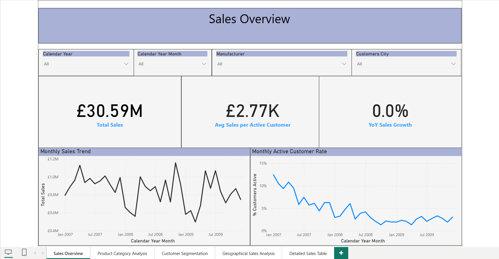
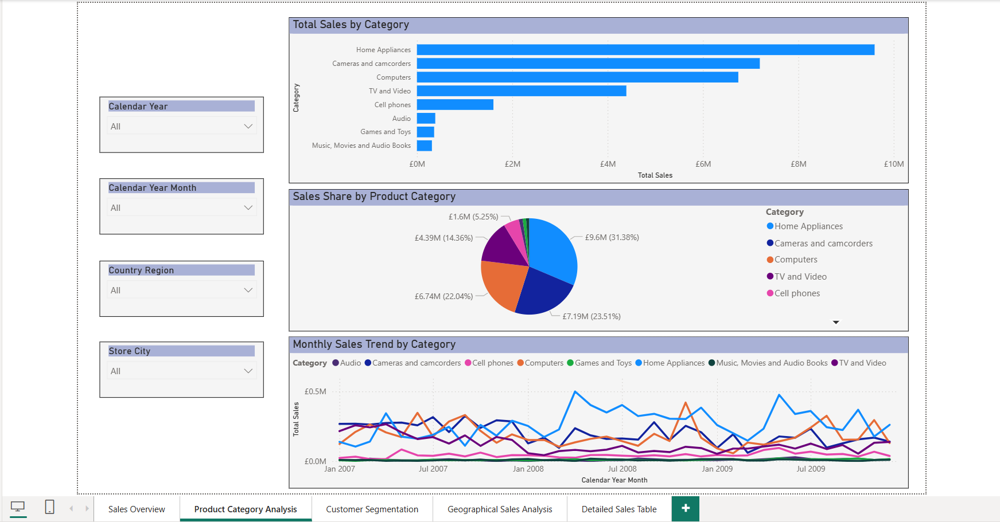
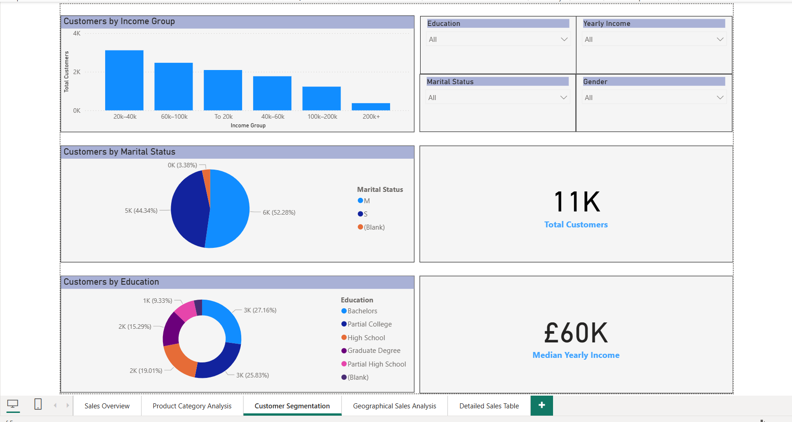
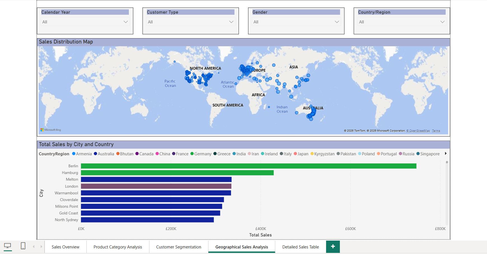
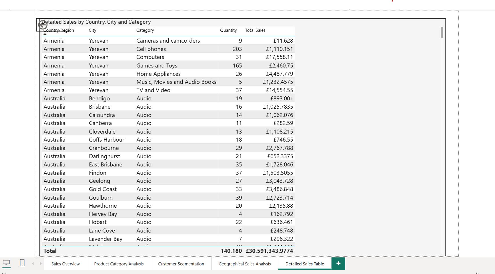

# Power BI Sales & Customer Analysis Dashboard

## Project Overview

This Power BI project analyzes sales performance, customer segments, product categories, and geographical sales distribution.

The dashboard was created to understand key business metrics such as total sales, average sales per active customer, customer activity, year-over-year sales performance, product category contribution, and sales distribution across countries and cities.

## Business Questions

This project answers the following business questions:

1. What is the total sales performance for the selected period?
2. How does sales performance change over time?
3. Which product categories generate the highest sales?
4. How are sales distributed across countries and cities?
5. What customer segments are represented in the dataset?
6. How do customers differ by income group, education, marital status, and gender?
7. What is the average sales value per active customer?
8. What percentage of customers are active in each period?
9. How does year-over-year sales performance change?

## Tools Used

* Power BI
* Power Query
* DAX
* Data visualization
* Dashboard design

## Dashboard Pages

### 1. Sales Overview

The Sales Overview page shows the main business KPIs:

* Total Sales
* Average Sales per Active Customer
* Year-over-Year Sales Growth
* Monthly Sales Trend
* Monthly Active Customer Rate

### 2. Product Category Analysis

This page analyzes sales performance by product category and shows:

* Total sales by product category
* Sales share by product category
* Monthly sales trend by category

### 3. Customer Segmentation

This page focuses on customer structure and segmentation:

* Customers by income group
* Customers by marital status
* Customers by education level
* Total customers
* Median yearly income

### 4. Geographical Sales Analysis

This page shows the geographical distribution of sales:

* Sales distribution map
* Total sales by city and country
* City-level sales comparison

### 5. Detailed Sales Table

This page provides detailed sales information by:

* Country / Region
* City
* Product Category
* Quantity
* Total Sales

## DAX Measures

The project includes custom DAX measures created for sales, customer, activity, income, and year-over-year analysis.

Main measures include:

* Total Sales
* Average Order Value
* Average Sales per Customer
* Avg Sales per Active Customer
* Customer Total Sales
* Customers This Period
* HasSales
* Median Yearly Income
* Total Customers
* Total Unique Customers All Time
* Unique Customers
* % Customers Active
* YoY Sales
* YoY Sales %

More details are available in the [DAX measures documentation](dax-measures.md).

## Key Insights

* Total sales for the selected period reached **£9.93M**.
* The dashboard shows a **-12.2% year-over-year sales change** for the selected year.
* Home Appliances generated the highest total sales among product categories.
* Cameras and camcorders, Computers, and TV and Video were also major contributors to sales.
* Customer distribution is strongest in the 20k–40k and 60k–100k income groups.
* The dashboard allows users to filter performance by year, month, country, city, manufacturer, customer type, gender, education, and income level.
* Sales performance varies significantly across cities and regions, making geographical analysis useful for business reporting.
* The customer segmentation page helps analyze customers by income, education, marital status, and gender.

## Skills Demonstrated

* Building a multi-page Power BI dashboard
* Creating KPI cards and interactive slicers
* Designing customer segmentation analysis
* Creating geographical sales visualizations
* Creating custom DAX measures
* Analyzing sales trends over time
* Tracking active customer percentage
* Presenting business insights through data visualization

## Screenshots

### Sales Overview



### Product Category Analysis



### Customer Segmentation



### Geographical Sales Analysis



### Detailed Sales Table



## Repository Structure

```text
power-bi-sales-customer-analysis/
│
├── README.md
├── dax-measures.md
├── sales-customer-analysis-dashboard.pbix
│
└── screenshots/
    ├── sales-overview.png
    ├── product-category-analysis.png
    ├── customer-segmentation.png
    ├── geographical-sales-analysis.png
    └── detailed-sales-table.png
```

## Conclusion

This project demonstrates how Power BI can be used to analyze sales performance, customer segments, product categories, and geographical distribution. The dashboard provides interactive reporting functionality and supports business decision-making through clear KPIs, filters, DAX measures, and visual insights.
